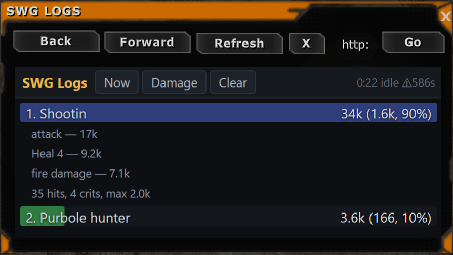

# swglogs



SWG Legends combat logs + Details-style meter, in Rust. **One normalized
combat-event stream, two sinks:** a live web meter and a real-time structured
log (JSONL). The event source is pluggable, so the same meter/log run on top of
either input:

```
                                      ┌─ meter aggregator ── http://127.0.0.1:8666/  (in-game /browser)
source ──> Event (normalized) ──┤
                                      └─ real-time log ────── combat-log.jsonl  (flushed per event)

sources:  memory (default)      the client's combat scrollback, read directly   (zero flush latency; run as Admin)
          chatlog tail          the player's own chatlog file                   (no elevation; lags until the game flushes)
          IPC ring              combat lines from an external producer         (zero flush latency)
          demo                  synthetic combat                               (no game needed)
```

Core is dependency-free (std only); only the window pulls in egui (see below).

## Build & run

```
cargo build --release
./target/release/swglogs                   # (as Administrator) opens the status window; reads the client's combat scrollback, serves :8666, logs combat-log.jsonl
./target/release/swglogs --headless        # same, console only (no window)
./target/release/swglogs --source chatlog  # tail the newest chatlog file instead (no elevation needed)
./target/release/swglogs --source demo     # synthetic combat, preview the page
./target/release/swglogs --source ipc    # drain the IPC ring (needs a producer feeding EV_COMBAT_SPAM)
./target/release/swglogs --selftest      # parser/aggregator checks vs real log lines
```

In game: `/browser http://127.0.0.1:8666/` (also `/healing`, `/taken` open on
that metric — the client spawns an independent browser window per call, so you
can run several).

### Options

`--source memory|chatlog|ipc|demo` (default memory) · `--port N` · `--host H` · `--gap S` (encounter
gap, default 8) · `--player NAME` (highlighted; unset by default) · `--profiles
DIR` · `--log FILE` (pin an exact chatlog) · `--replay` (parse the whole log
first, then tail) · `--out FILE` (JSONL log, default `combat-log.jsonl`) ·
`--no-log` · `--selftest` · `--game-dir DIR` (game install, default: parent of
`--profiles`) · `--no-ui-patch`.

On startup swglogs patches the game's loose `ui\ui_pda.inc` (if present) so the
`/browser` window carries `StickyVisible='true'` and stays open when you leave
cursor mode — otherwise the client hides every window in shoot mode. A backup
is kept as `ui_pda.inc.pre-swglogs`; the change applies from the next game
start. `--no-ui-patch` disables it.

## The window

One executable. Double-clicking `swglogs.exe` opens a 640x480 egui window with
a single **Logging** tab: whether SWG Logs is running, the in-game `/browser`
macro to open the meter, and the restart-the-client notice when the UI patch
just landed. Closing the window stops the meter. More tabs
are coming. `--headless` skips the window (console only); when started from a
terminal the exe attaches to it so `--headless`, `--selftest` and `--help`
print normally.

The window is Cargo feature `gui` (on by default; pulls in `eframe`/`egui`).
`cargo build --release --no-default-features` gives a std-only console build
that needs no registry access.

## The two outputs

**Meter page** — ranked bars, header cycles Now/Last/All and Damage/Healing/
Taken; click a row for its ability breakdown (hits/crits/max). Shows a `⚠Ns`
staleness marker when the chatlog hasn't advanced (the game buffers its writes;
our own log below does not).

**Real-time log** (`combat-log.jsonl`) — one JSON object per event, flushed
immediately, with the full context the game's four-number native meter throws
away:

```json
{"ts":1788305368.019,"iso":"2026-09-01T23:29:28Z","kind":"damage","src":"Yourname","tgt":"Elder mamien","amount":973,"outcome":"blocked","ability":"attack","raw":"Yourname hits (blocked) an elder mamien 973 pts"}
```

`outcome` is one of normal/critical/glancing/blocked/evaded/dodged/parried/miss.

## Sources

- **memory** (`src/sources.rs::memory`, default) — opens `SwgClient_r.exe`
  read-only (no injection) and reads the combat chat scrollback straight out of
  the client, so lines arrive the moment the game renders them. Needs swglogs
  to run as Administrator because the client runs elevated. Locates the live
  buffer by watching which candidate text actually advances, resyncs on the
  buffer's own line text (the scrollback shifts on every append once it hits
  its line cap), and holds the newest line back one tick so a line caught
  mid-write is never consumed torn.

- **chatlog** (`src/sources.rs::chatlog_tail`) — finds the newest
  `profiles/*/*/*_chatlog.txt`, tails it, parses each `[Combat]` line
  (`src/parse.rs`, grammar verified against a real Sep-2026 log — hits, crits,
  glances, strikes-through, applied + self DoTs, heals, `performs`-based ability
  labeling, misses, deaths). No elevation needed. Cost: the game buffers
  chatlog writes, so lines can lag until a flush.

- **ipc** (`src/sources.rs::ipc`) — opens a shared-memory mapping and drains
  `EV_COMBAT_SPAM` records, whose payload is the combat line, through the same
  parser. Zero flush latency, and it can carry group combat. Requires an
  external producer that pushes those records; the reader here is ready for
  when one feeds it. Ring layout constants must match the producer.

## Assets

`assets/` holds the icon (`swglogs-icon.svg` + PNG renders, `favicon.ico`).
Everything ships inside the single exe: `build.rs` embeds `assets/swglogs.ico`
as the executable's icon (generate it with `python assets/gen_ico.py` after
changing the source PNG), the window icon is the 256 px PNG via
`include_bytes!`, and the meter page serves `favicon.ico` from the binary.

## Layout

`lib.rs` the library root · `event.rs` schema + JSON · `parse.rs` line→event
grammar · `meter.rs` encounter aggregation + snapshot JSON · `logwriter.rs`
JSONL sink · `server.rs` std-only HTTP + `page.html` · `sources.rs` the four
sources + the `Sink` fan-out · `uipatch.rs` the in-game browser StickyVisible
patch · `app.rs` config/args + startup wiring shared by both binaries ·
`main.rs` the entry point + self-test · `gui.rs` the egui window (feature `gui`).
